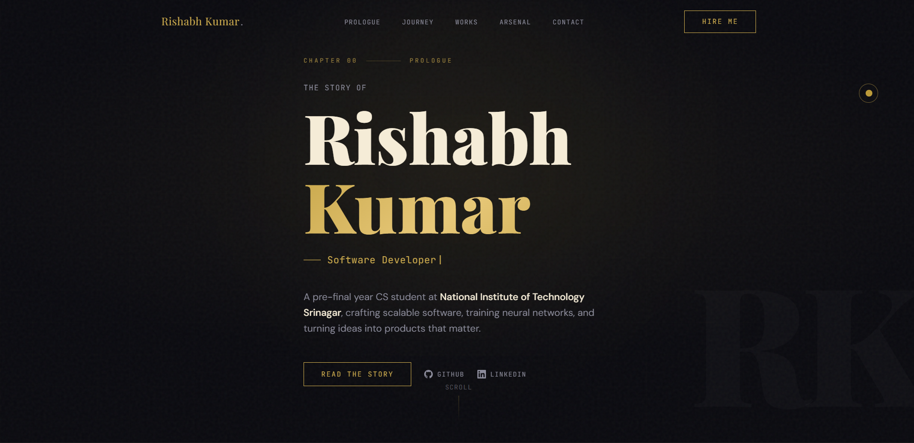

# 🌐 Rishabh Kumar — Portfolio

A modern personal portfolio website built with Next.js, showcasing my projects, skills, and experience in software development and machine learning.

---

## 🚀 Features

- ⚡ Fast and responsive UI
- 🎨 Clean and minimal design
- 📂 Projects showcase
- 🧠 Skills & experience section
- 📬 Contact section
- 🌙 Smooth user experience

---

## 🛠️ Tech Stack

- **Frontend:** Next.js, React, Tailwind CSS
- **Language:** TypeScript / JavaScript
- **Deployment:** Vercel

---

## 📸 Preview



---

## ⚙️ Getting Started

### 1. Clone the repository
```bash
git clone https://github.com/yourusername/portfolio.git
cd portfolio